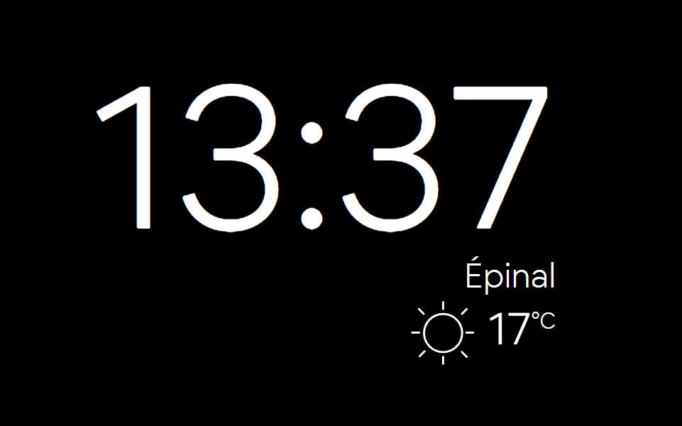

# HTML simple clock
A simple weather-clock in HTML

You have to put your OpenWeather API key in [./api_key.js](./api_key.js) file.

If you don't have one, create a free account and get your API key from here: [https://home.openweathermap.org/api_keys](https://home.openweathermap.org/api_keys)

You can add some GET parameter to configure the clock.

| Parameter  | Value |
| ---------- | ----- |
| **`city`** | City name from where to get the weather. Default = `Epinal`       |
| **`hide`** | Can use several of the following values, separated by a coma.<li>`weather` to disable and hide the weather part</li><li>`city` to hide the city name</li><li>`icon` to hide the weather icon</li><li>`temp` to hide the temperature</li><li>`desc` to hide the weather description</li><li>`footer` to hide the footer (only used for some devices)</li> |
